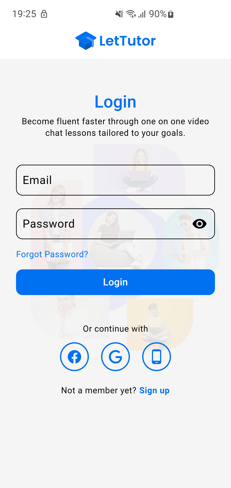
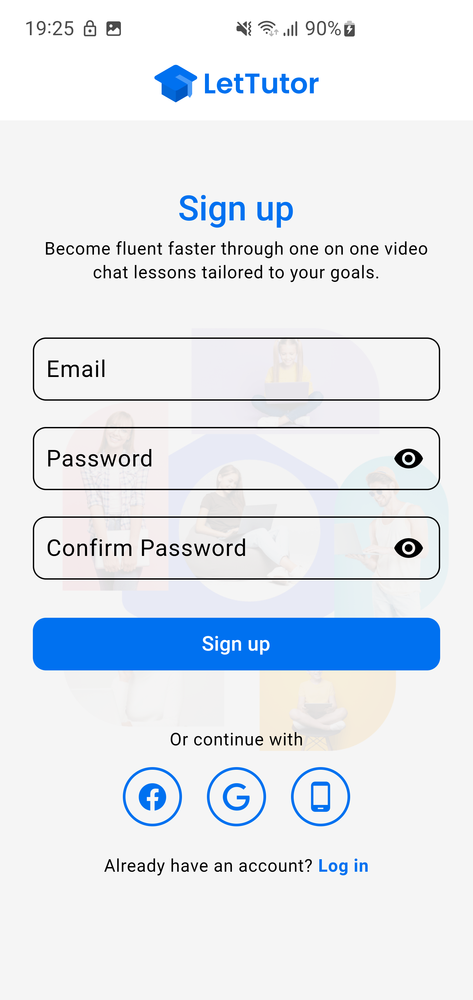
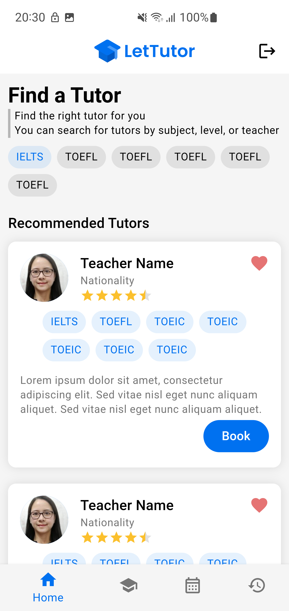
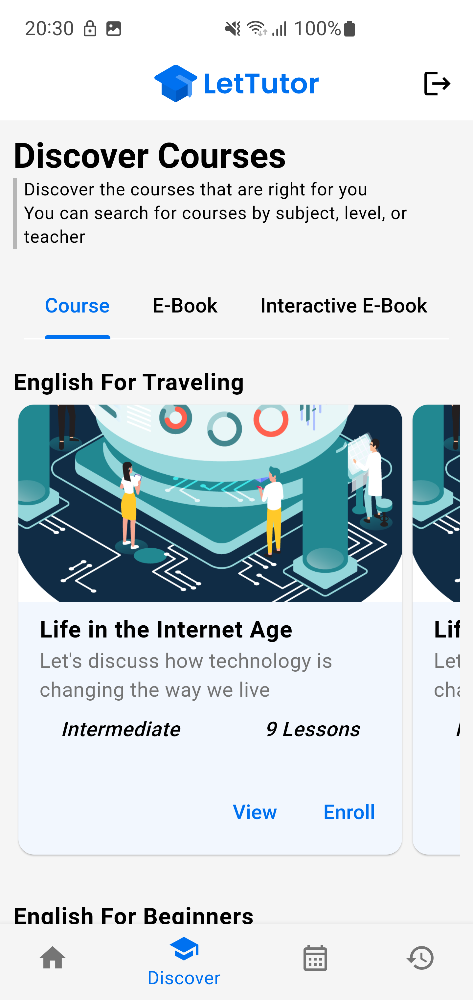
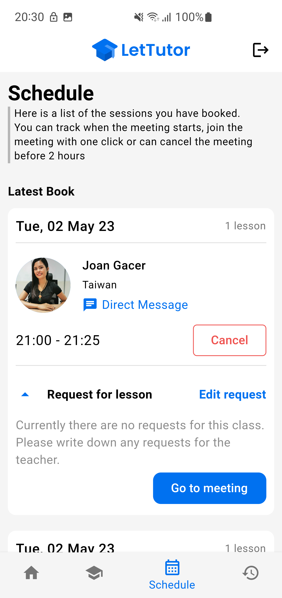
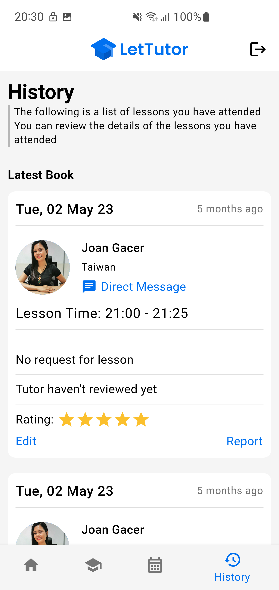
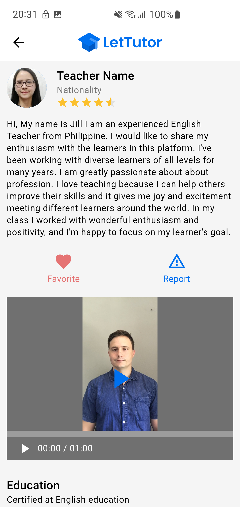
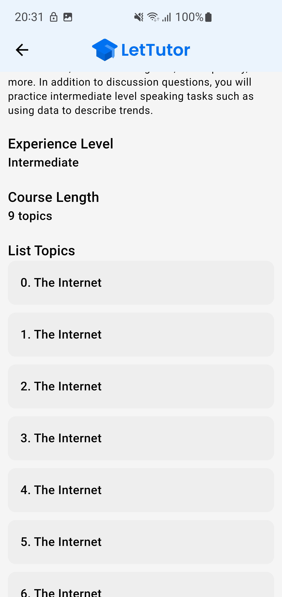
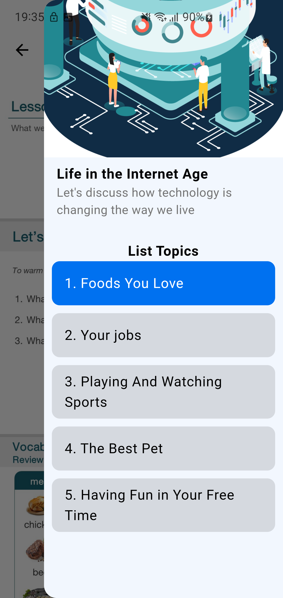

# LetTutor - Advanced Mobile App Development

## Milestone 1: Mockup UI

- Widget Tree: https://drive.google.com/file/d/1rubRvaHtECCZeoMinrZB_6wdFatCj6Qq/view?usp=sharing

- Navigation and routing

- Implement UI

## Milestone 2:

- Demo: https://drive.google.com/file/d/1p8aAGgQ9h0ET3DizHr_DjojExEViqA1O/view

  
  
  
  
  
  
  
  
  
  
  
  
  
  
  

